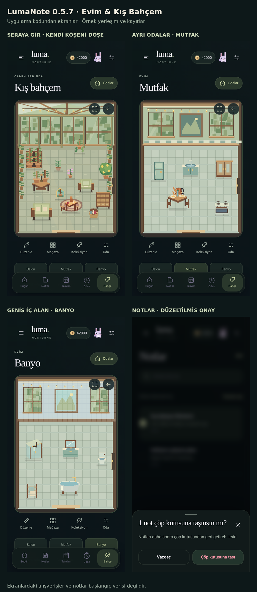

# LumaNote — Evim & Kış Bahçem

**Kaynak sürümü: 0.5.7**  
**Çalışan arayüz etiketi: `LUMA-0.5.7-HOME-GREENHOUSE`**

Odak oturumlarını, notları, planlamayı ve çalışma süresiyle gelişen bir piksel bahçeyi
bir araya getiren Expo / React Native projesi.

> **Tek proje, tek klasör.** Bu depoda 0.5.7'nin bütün kaynakları bulunur.
> Önceki 0.4 / 0.5.3 / 0.5.4 / 0.5.5 / 0.5.6 paketlerini ayrı ayrı uygulama.
> Bu, sohbetten teslim edilen son kaynak paketinin GitHub düzenidir; kullanıcının
> Mac'inden alınmış güncel disk kopyası veya telefonundaki verilerin yedeği değildir.



## Önce hangi dosyayı açmalıyım?

| Amaç | Dosya |
|---|---|
| Bu klasörü Terminal'den GitHub'a yüklemek | [GITHUBA_YUKLEME.md](GITHUBA_YUKLEME.md) |
| Uygulamayı ve kodu sıfırdan öğrenmek | [Görselli rehber — PDF](docs/rehber/LumaNote_Gorselli_Egitim_ve_Gelistirici_Rehberi.pdf) |
| Rehberi düzenlemek | [Görselli rehber — Word](docs/rehber/LumaNote_Gorselli_Egitim_ve_Gelistirici_Rehberi.docx) |
| Küçük örneklerle kod denemek | [Öğrenme atölyesi](examples/ogrenme-atolyesi/README.md) |
| Paketin kaynağını, korunan dosyaları ve sınırlarını görmek | [Paket raporu](docs/GITHUB_PAKET_RAPORU.md) |
| Önceki 0.5.7 test kapsamını okumak | [Özgün sürüm test raporu](docs/TEST_RAPORU_057.md) |

## Uygulamada neler var?

**Notlar:** Metin biçimlendirme, renkler, toplu seçim, çöp kutusu, kâğıt arka planları,
çizim alanı, tablo ve dosya ekleri. PDF için görüntüleme ve işaretleme kaynakları da
bulunur; gerekli kitaplıklar npm kurulumu ve arayüz üretimi sırasında eklenir.

**Odak ve planlama:** Çalışma yöntemleri, çalışma / mola ayarları, tam ekran sayaç,
haftalık özet ve çalışma sonunda jeton ödülü. Mola süresi çalışma kazancı üretmez.

**Yaşayan bahçe:** Tohum yetiştirme, anı bitkileri, hayvanlar, dekorlar, mevsimsel
atmosferler ve sınırları olan yakınlaştırılabilir piksel sahne.

**Ev ve sera:** Salon, mutfak, banyo, dinlenme odası, yatak odası ve kış bahçesi.
Eşyalar alanlara atanabilir, yön oklarıyla veya düzenleme modunda sürüklenerek taşınabilir.

**Tematik mağazalar:** Japon / Sakura, Çay & Kilim, Yılbaşı, Cadılar Bayramı ve Sera & Odalar.

**Ses ve yedekleme:** Katmanlı ortam sesleri, farklı sentez piyano besteleri, dosya
dışa / içe aktarma ve isteğe bağlı şifreli yedek akışı. Seslerin kaynak ve lisans
notları [licenses](licenses/) klasöründedir. Sentez parçalar gerçek saha veya
akustik performans kayıtları olarak sunulmaz.

Ekran görüntülerindeki notlar, mobilyalar ve bakiyeler örnek kayıtlardır; uygulamanın
başlangıcına satın alınmış öğe veya kişisel çalışma geçmişi eklenmez.

## Teknik yapı

| Katman | Kullanılan yapı | Ana konum |
|---|---|---|
| Telefon uygulaması | TypeScript, React Native, Expo, WebView | `App.tsx`, `nocturne/` |
| Arayüz ve iş kuralları | HTML, CSS, JavaScript | `tools/ui/` |
| Piksel sahneler ve hareket | Canvas; lava temalarında WebGL ve yedek çizim | `tools/ui/` |
| Üretilmiş arayüz | Önizleme HTML'i ve WebView'in kullandığı TypeScript çıktısı | `ONIZLEME.html`, `nocturne/UI_HTML.ts` |
| Üretim ve doğrulama | Node.js / CommonJS | `tools/*.cjs` |
| Görsel / ses üreticileri ve tarihsel testler | Python, JavaScript | `tools/*.py`, `tests/` |

`index.js → App.tsx → nocturne/UI_HTML.ts` uygulamanın başlangıç zinciridir.
Arayüz değişikliklerini `tools/ui/` içinde yap. `UI_HTML.ts` ve `ONIZLEME.html`
aynı kaynaklardan üretildiği için yalnızca birini elle düzenleme.

Dosya adında `v04`, `054`, `055` veya `056` bulunması onun gereksiz olduğu anlamına
gelmez. Son sürüm, bu birikimli modülleri de yükler; klasörleri isimlerine bakarak silme.

## Kurulum yapmadan kaynak doğrulama

Node kurulu bir Terminal'de, **bu klasörün içindeyken**:

```bash
node tools/verify.cjs
```

Bu kontrol npm paketlerini yüklemez; sürüm, başlangıç dosyaları, üretilmiş arayüz,
ses hash'leri ve temel kaynak bütünlüğünü kontrol eder. Gerçek iPhone testi değildir.
GitHub'a kaynak yüklemek için npm kurulumu yapmak zorunlu değildir.

## Ayrı bir geliştirme kopyası olarak çalıştırma

Bu kaynak `package.json` içinde Node 24 ve Expo 57 bağımlılıklarını tanımlar.
İlk kurulum internet erişimi gerektirir. Kurulu telefon projesinin yerine otomatik
geçmez, telefon verilerini kendiliğinden taşımaz.

Node / npm / npx bilgisayarda bulunduğunda, bu klasörde:

```bash
npx --yes --package=node@24 --call 'node tools/setup.cjs'
```

Mevcut `setup.cjs` ilk açılışta npm paketlerini kurar, Expo 57 paket uyumunu kontrol
eder, arayüzü yeniden üretir ve Expo Go sunucusunu başlatır. Konsolda **bu klasörün
tam yolunu** ve `LUMA-0.5.7-HOME-GREENHOUSE` etiketini kontrol et. Hata olursa dur;
başka eski klasörden dosya kopyalayarak veya sürümleri rastgele değiştirerek devam etme.

**Paket kilidi hakkında:** Teslim edilen özgün 0.5.7 arşivinde `package-lock.json`
yoktu. Bu pakete başka sürümün kilidini kopyalamadık veya doğrulanmamış bir kilit
uydurmadık. Başarılı ilk kurulumda oluşan kilidi Git'e ekle. Bu nedenle mevcut
Mac kurulumundaki kesin bağımlılık ağacını bu arşivden birebir yeniden üretme
garantisi yoktur. `npm ci` ancak geçerli bir kilit dosyası oluştuktan sonra kullanılmalı.

Kaynak düzenledikten sonra:

```bash
npm run build:ui
npm run verify
```

Eski yerinde-güncelleme yardımcıları (`*.command`, `tools/repair-existing.cjs` ve
`README_TR.md`) geçmiş kaynak bütünlüğü için korunmuştur. **Bu klasörü GitHub'a
koymak için onları çalıştırman gerekmiyor.** Özellikle güncelleyiciyi eski
`LumaNote_Nocturne_Final` klasörüne rastgele uygulama.

## Test jetonları ve kişisel veriler

Bu kaynakta `LUMA_TEST_COINS_SWITCH = false`. 100.000.000 test jetonu otomatik verilmez.
Test cüzdanı ve kapatma/geçiş kodları korunmuştur; gerçek çalışma süresi uydurulmaz.
Bu paket telefonundaki not, bahçe yerleşimi veya mevcut test bakiyesini içermez.

**Önemli:** Test jetonları açıkken oluşturulmuş bir yedeği test anahtarı kapalı bu
kopyada açarsan, var olan geçiş kodu test bütçesini ve testle alınmış öğeleri
ayıklayabilir. Bu bir kod paylaşım paketidir; canlı verinin üzerinde yedeksiz test yapma.

## Kapsam ve sınırlar

Bu GitHub hazırlığında özellik geliştirmesi yapılmadı; telefon ve arayüz kaynakları,
sesler, çizimler, `package.json` ve `app.json` özgün 0.5.7 paketiyle aynı tutuldu.
Paket hazırlama kontrolleri [ayrı raporda](docs/GITHUB_PAKET_RAPORU.md) yer alır.

Önceki test raporlarının rakamları geçmiş çalıştırmalardır; bu pakette tekrar
çalıştırılmış yeni telefon testleri olarak yorumlanmamalıdır. Fiziksel iPhone / Expo
Go, yeni npm kurulumu, Metro iOS derlemesi, PDF uçtan uca akışı ve gerçek ses dinleme
bu paketleme işinde yapılmadı. Arka planda / kilit ekranında sesin durması mevcut
davranıştır. GitHub'a kaynak yüklemek, App Store veya Google Play yayını değildir.

## Paylaşım

İlk GitHub deposunu **Private** olarak açmak önerilir. Bu paketleme işleminde
projeye yeni bir açık kaynak lisansı atanmadı. Üçüncü taraf kaynak ve ses notları
`licenses/` içinde korunmuştur. `.gitignore` yaygın gizli / geçici dosyaları dışarıda
bırakır; yine de sonradan eklenen dosyaları `git status` ve `git diff --cached` ile
kontrol etmek gerekir. Kişisel kayıt yedeklerini depoya koyma.
